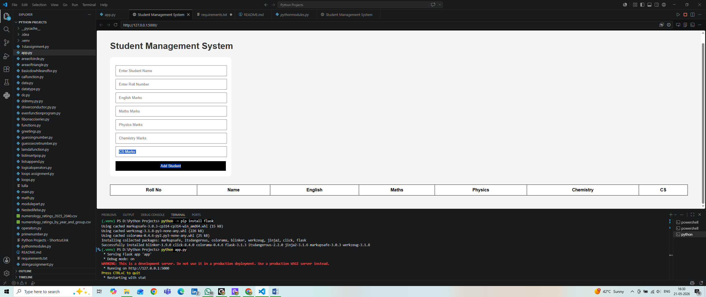
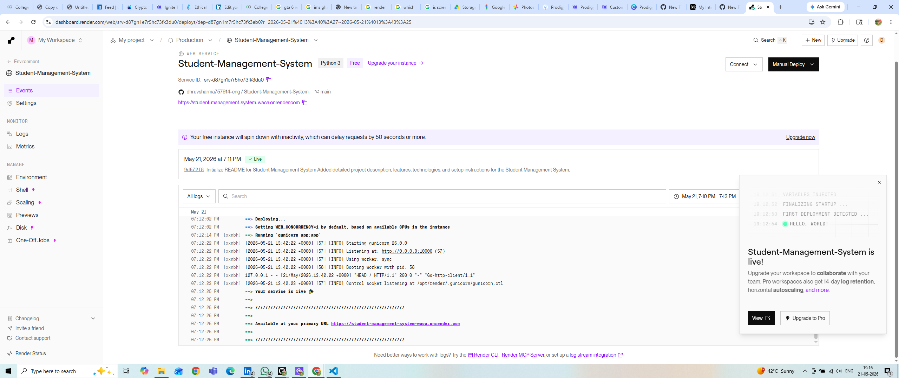
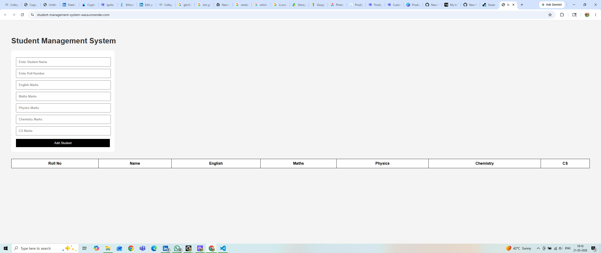

# Student Management System

A Flask-based Student Management System that allows users to manage student academic records, calculate results, and view performance through a clean and interactive web interface.

---

## About

A web-based Student Management System developed using Python and Flask. This project enables users to add, manage, and generate student academic records through a simple and interactive 
browser interface. The application was originally built as a Python console-based project and later upgraded into a Flask web application for localhost hosting and online deployment using 
Render.

---

## Live Demo

https://student-management-system-waca.onrender.com/

---

## Features

- Add student details
- Calculate total marks and percentage
- Generate student results
- Interactive browser-based interface
- Flask backend integration
- Responsive design
- Hosted online using Render

---

## Tech Stack

- Python
- Flask
- HTML
- CSS
- Gunicorn
- Render

---

## Project Structure

```bash
Student-Management-System/
│
├── app.py
├── requirements.txt
├── README.md
├── LICENSE
├── homepage.png
├── renderdashboard.png
├── resulthosted.png
│
├── templates/
│   └── index.html
│
└── static/
    └── style.css
```

---

## Files & Folders to Upload on GitHub

Upload these files and folders:

### Files
- `app.py`
- `requirements.txt`
- `README.md`
- `LICENSE`
- `homepage.png`
- `renderdashboard.png`
- `resulthosted.png`

### Folders
- `templates`
- `static`

---

## Project Preview

### Homepage Preview


---

## Render Deployment Dashboard


---

## Hosted Website Result


---

## Installation

### Clone the repository

```bash
git clone https://github.com/yourusername/Student-Management-System.git
```

### Navigate to the project folder

```bash
cd Student-Management-System
```

### Install dependencies

```bash
pip install -r requirements.txt
```

### Run the application

```bash
python app.py
```

---

## Deployment

This project is deployed on Render using:

```bash
gunicorn app:app
```

---

## License

This project is licensed under the MIT License.

---

## Author

Dhruv Sharma

GitHub:
https://github.com/yourusername
